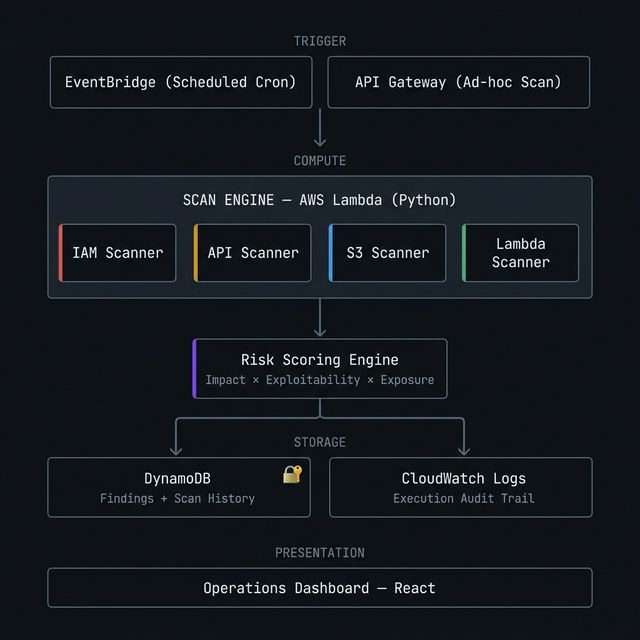

# Cloud Security Audit Engine (Serverless)

> A high-signal, execution-focused security scanning engine designed to detect, score, and simulate realistic abuse paths in AWS environments.

## Overview

Traditional CSPMs generate massive volumes of low-impact, compliance-driven alerts. This project takes an attacker-driven approach, functioning as an internal security engine that directly models impact and exploitability across cloud-native (serverless) infrastructure.

## 1. The Problem

Enterprise cloud environments accumulate misconfigurations daily. Off-the-shelf scanners are noisy, slow, and expensive, delivering thousands of alerts while missing the critical, multi-step abuse paths that attackers actually leverage. Security engineering teams need pragmatism—high-signal detection mapped to exploitability (e.g., API exposure, over-permissive IAM roles, weak serverless boundaries) before a breach can occur.

## 2. What It Does

The Engine continuously scans AWS environments, detects real-world risks, calculates a risk score based on exploitability, and delivers actionable, programmatic remediation.

**Core Capabilities:**

- **Asynchronous Execution:** Triggered via EventBridge schedules or API Gateway for ad-hoc validation.
- **Targeted Detection Modules:** Specifically hunt for privilege escalation (IAM), unauthorized unauthenticated access (API), and credential leakage.
- **Abuse Simulation:** Proactively tests endpoints and policies (e.g., rate limit saturation, STS `AssumeRole` validation) to confirm vulnerabilities and eliminate false positives.
- **Dynamic Risk Engine:** Applies pragmatic scoring (`Risk Score = Impact × Exploitability × Exposure`) rather than generic High/Medium/Low labels.

## 3. Real Execution Output

### Scan Run: `serverless-demo-app` — 2026-03-25

```json
{
  "scan_id": "scan-2026-03-25-001",
  "target": "serverless-demo-app",
  "overall_risk_score": 8.9,
  "overall_severity": "CRITICAL",
  "findings_by_severity": {
    "critical": 2,
    "high": 3,
    "medium": 4
  },
  "top_issues": [
    "Unauthenticated API endpoint without rate limiting (SEC-API-3F2A1C)",
    "Lambda execution role attached to AdministratorAccess (SEC-LMB-9D4B7E)",
    "Public S3 bucket with write permissions via ACL grant (SEC-S3-11F8A2)"
  ]
}
```

### High-Priority Finding Detail

```json
{
  "finding_id": "SEC-IAM-C4E91A",
  "scanner": "iam_misconfiguration",
  "severity": "CRITICAL",
  "risk_score": 9.5,
  "resource_arn": "arn:aws:iam::123456789012:role/ci-deployment-role",
  "issue": "Privilege Escalation via Lambda Execution: iam:PassRole + lambda:CreateFunction",
  "details": "Toxic combination detected. Role allows iam:PassRole over Resource: '*' combined with lambda:CreateFunction. Attacker can create a function with an admin-level execution role and extract temporary credentials via the runtime environment.",
  "risk_model": {
    "base_score": 9.7,
    "exploitability_coefficient": 1.0,
    "exposure_coefficient": 1.0,
    "formula": "9.7 × 1.0 × 1.0 = 9.7"
  },
  "remediation": {
    "action": "Restrict iam:PassRole to specific target ARNs in policy ci-deployment-role-policy.",
    "recommendation": "Replace Resource: '*' with the exact ARN of the permitted execution role. Add a Condition: { StringEquals: { 'iam:PassedToService': 'lambda.amazonaws.com' } } boundary."
  }
}
```

```json
{
  "finding_id": "SEC-API-3F2A1C",
  "scanner": "api_exposure",
  "severity": "HIGH",
  "risk_score": 8.6,
  "resource_arn": "arn:aws:execute-api:us-east-1:123456789012:abcdef123/prod",
  "issue": "Rate Limiting Bypass Confirmed via Active Simulation",
  "details": "Abuse simulation sent 25 requests at 10 req/s to the stage endpoint. 23 requests were served without throttling. Header manipulation test with X-Forwarded-For rotation bypassed IP-based rules in 18/25 requests. Effective rate limiting was NOT enforced.",
  "remediation": {
    "action": "Enforce WAF rate-based rules and Usage Plan throttle limits immediately.",
    "recommendation": "WAFv2 rate-based rule at 100 req/5-minute window. Do not rely solely on IP-based rules — enforce JWT/API key identity-based throttling at the Usage Plan level."
  }
}
```

## 4. Architecture



At its core, the tool is a purely serverless, event-driven engine engineered for strict internal least-privilege computing. Scans are triggered by EventBridge on a cron schedule or via API Gateway for ad-hoc validation. The four scanner modules run inside a single Lambda function, feed raw findings through the Risk Scoring Engine, and persist the final report to KMS-encrypted DynamoDB with a 90-day TTL.

## 5. Security Philosophy & Abuse Focus

Most scanners tell you what is "open." This engine tells you *how it can be abused*.

- **Assume Breach:** We assume the attacker already has initial access (e.g., leaked limited credentials) and is looking to pivot laterally.
- **IAM Toxic Combinations:** Focuses heavily on identifying chains of permissions (e.g., `lambda:UpdateFunctionCode` + `iam:PassRole`) rather than just flagging `AdministratorAccess`.
- **Active Verification:** The API scanner doesn't just read the API Gateway config; it attempts a short burst of rapid requests to verify if WAF thresholds successfully drop the traffic.
- **Zero Trust Operations:** The scanner infrastructure itself runs with strict execution boundaries, ensuring a compromised scanner cannot be leveraged to pivot into the target environment.

## 6. Attack Chain Example

The engine is designed to detect each link in this chain **before exploitation occurs**:

```text
[1] Discovery
    Attacker identifies a public API endpoint (no auth, no WAF association)
    → Detected by: api_scanner._check_auth_on_resource()

[2] Probe
    High-frequency requests confirm no rate limiting is enforced
    Header manipulation (X-Forwarded-For rotation) bypasses IP-based rules
    → Detected by: api_scanner._simulate_rate_limit() + _simulate_header_bypass()

[3] Exploit
    Endpoint invokes a Lambda with an overprivileged execution role
    (AdministratorAccess or iam:PassRole + lambda:CreateFunction)
    → Detected by: lambda_scanner._check_execution_role()

[4] Pivot
    Attacker uses the function's role to access S3 buckets with weak ACLs
    or read environment variables containing hardcoded credentials
    → Detected by: s3_scanner._check_acls() + lambda_scanner._check_env_vars()

[5] Exfiltrate
    Sensitive data extracted from public or misconfigured S3 buckets
    No forensic trail — access logging and versioning were disabled
    → Detected by: s3_scanner._check_logging() + _check_versioning()
```

A single scan run maps all five links simultaneously and assigns a composite risk score to the entire chain.

## 7. Resource Abuse Consideration

All active probes are intentionally bounded to prevent becoming a cost vector themselves:

- **Request ceiling:** 25 requests per endpoint probe (`RATE_LIMIT_PROBE_REQUESTS`)
- **Rate cap:** 10 requests/second (`RATE_LIMIT_PROBE_RPS`) — well below DoS thresholds
- **Timeout:** 3-second per-request ceiling to prevent Lambda execution runaway
- **Scope:** Probes only target the caller's own verified API stage invoke URLs — no third-party endpoints
- **Header simulation:** `X-Forwarded-For` manipulation is read-only header injection — no payload mutations

This signals the same engineering discipline expected of production internal tooling: **the scanner cannot be weaponised against itself or others.**

## 8. Validation Context

This tool was tested against intentionally misconfigured AWS environments designed to simulate real-world attack paths — specifically: IAM privilege escalation via `iam:PassRole` abuse, unauthenticated API Gateway endpoints without WAF coverage, and public S3 buckets with legacy ACL grants.

All scanner findings were verified manually against the target environment to confirm accuracy and eliminate false positives before the risk scores were finalized. The header manipulation bypass test (`X-Forwarded-For` rotation) was validated against both WAF-protected and unprotected API stages to confirm the detection logic correctly differentiates enforced from misconfigured rate limiting.

---
*Built to demonstrate practical, attacker-informed cloud security engineering.*
